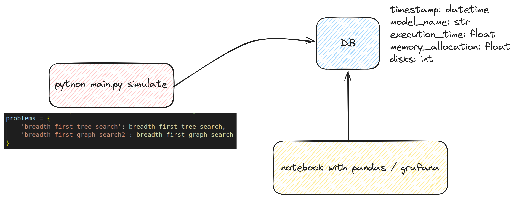

# IIA-TP1 - Algoritmos de búsqueda en Torre de Hanoi (18Co2024)


- Apertura: jueves, 2 de mayo de 2024, 00:00
- Cierre: domingo, 15 de septiembre de 2024, 23:59


En clase presentamos el problema de la torre de Hanoi. Además, vimos diferentes algoritmos de búsqueda que nos permitieron resolver este problema. Para este trabajo práctico, deberán implementar un método de búsqueda para resolver con 5 discos, del estado inicial y objetivo.

### Tareas y preguntas a resolver:

1) ¿Cuáles son los PEAS de este problema? (Performance, Environment, Actuators, Sensors)
2) ¿Cuáles son las propiedades del entorno de trabajo?
3) En el contexto de este problema, establezca cuáles son los: estado, espacio de estados, árbol de búsqueda, nodo de búsqueda, objetivo, acción y frontera.
4) Implemente algún método de búsqueda. Puedes elegir cualquiera menos búsqueda en anchura primero (el desarrollado en clase). Sos libre de elegir cualquiera de los vistos en clases, o inclusive buscar nuevos.
5) A nivel implementación, ¿qué tiempo y memoria ocupa el algoritmo? (Se recomienda correr 10 veces y calcular promedio y desvío estándar de las métricas).
6) Si la solución óptima es 2k -1 movimientos con k igual al número de discos. Qué tan lejos está la solución del algoritmo implementado de esta solución óptima (se recomienda correr al menos 10 veces y usar el promedio de trayecto usado).

El entregable es, por un lado, un archivo de txt/PDF/Word con las respuestas y por otro, los archivos con el código implementado, tambien pueden enviar una Notebook con el contenido y la solución. Si además agregan los json para usar en el simulador, es mejor. Pueden subir el contenido o proporcionar un enlace a un repositorio público (GitHub o GitLab) con el contenido. No olvidar especificar en el entregable los autores del TP.

Para resolver este TP son libres de usar los recursos que crean necesarios. Pueden resolverlo en cualquier lenguaje de programación y de la forma que consideren apropiada.

Pueden ahorrar tiempo usando el código ya implementado en Python que se encuentra en el repositorio hanoi_tower. Si usan este código, solo deben implementar el algoritmo de búsqueda, pero es importante que lean el código y entiendan que es cada parte


### Usar script
```bash
# instalar dependencias
pip install -r requirements.txt
```

Definir diccionario con mapeo de algoritmos aplicar para encontrar soluciones
```python
problems = {
        'breadth_first_tree_search': breadth_first_tree_search,
        'breadth_first_graph_search2': breadth_first_graph_search
    }
```

```bash
# resolver hanoi con parametros definidos en main.py
python main.py solve

--------------------------------------------------
Solving problem using breadth_first_tree_search
233 caminos se expandieron y 10 caminos quedaron en la frontera
Tiempo que demoró execute_algorithm: 0.052971 [s]
Maxima memoria ocupada: 0.32 [MB]
Longitud del camino de la solución: 31.0
--------------------------------------------------
Solving problem using breadth_first_graph_search2
233 caminos se expandieron y 10 caminos quedaron en la frontera
Tiempo que demoró execute_algorithm: 0.067039 [s]
Maxima memoria ocupada: 0.29 [MB]
Longitud del camino de la solución: 31.0
```

Correr simulacion. Se generaran dos archivos JSON por algoritmo de busqueda utilizado en **./src/simulator/solutions** llamados **initial_state_{name}.json** y **sequence_{name}.json**. Entonces, para ejecutar una simulación realizamos lo siguiente:

```bash
# correr simulacion con ultima solucion generada
python main.py simulate breadth_first_tree_search
python main.py simulate breadth_first_graph_search2
```

### Data Analysis


### Referencias
- Implementación: [Torres de Hanoi](src/README.md)